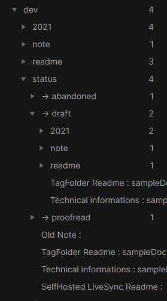

## TagFolder

This is the plugin that shows your tags as like a folder.


### How to use

Install this plugin, press `Ctrl+p`, and choose "Show Tag Folder".

### Behavior

This plugin creates a tree by tags permutation.

Like this,
### Simple case

If you have the docs,
```
Apple : #food #red #sweet
Pear  : #food #green #sweet
Tuna  : #food #red
```


...and more are shown.

So if you tag many to each doc, It would be heavy.

I'll make the new options that delay the folder expansion in the tree, but it will have the limitations that active file marking would be disabled till expanding the tree.

### Case of respecting nested tags

The nested tag works well for Tag Folder.

Tag Folder respects nested tags and makes the dedicated hierarchy. The nested child doesn't leak out over the parent.

```
TagFolder Readme: #dev #readme #2021/12/10 #status/draft
Technical informations: #dev #note #2021/12/09 #status/draft
SelfHosted LiveSync Readme : #dev #readme #2021/12/06 #status/proofread
Old Note: #dev #readme #2021/12/10 #status/abandoned
```
#### Tag hierarchy of status



#### Tag hierarchy of date


#### Search tags
You can search tags. As like this:

```
sweet -red | food -sweet
```
When using this filter, this plugin shows only "Pear" (Sweet but not red) and "Tuna" (food but not sweet).

### Settings

#### Always Open

Open Tag Folder when obsidian launched automatically.

#### Display Method

You can configure how the entry shows.
#### Order method (Tags)

You can order tags by:
- Filename
- Count of items

#### Order method (Items)

You can order items by:
- Displaying name
- Filename
- Modified time
- Fullpath of the file

#### Ignore note Tag

If the note has the tag that is set in here, the note would be treated as there was not.

#### Ignore Tag

Tags that were set here would be treated as there were not.